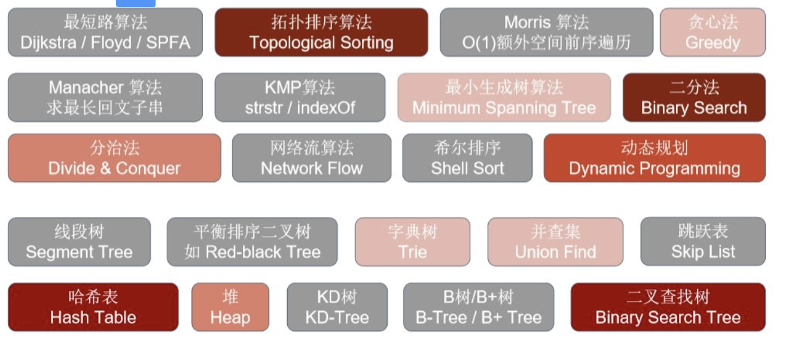
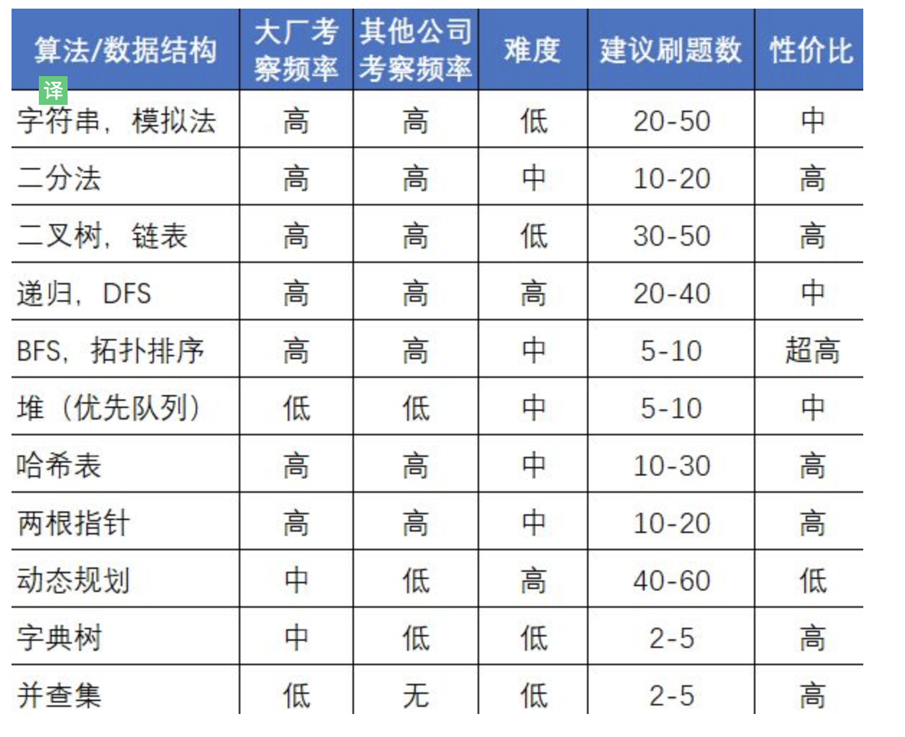

# fuck-leetcode
## TODO [Important point]
1. 回溯算法(回溯算法就是纯暴力穷举) 全排列
2. 双指针 判断回文字符串
### 面试面试常见知识点的考察频率及大厂考察要点。

> 以下转载自[知乎-九章算法](https://www.zhihu.com/question/36738189/answer/1240179104)
1. 面试频率一览表(颜色越红，表示面试中碰到的概率越高,灰色的基本不考或者出现概率很低):
  
2. 大厂考察要点
  

### 刷题步骤
**重点 千万不要眼高手底，一定要提交并通过。**
**实在做不出来可以看别人的解题思路，抄一遍，然后过几天再做一遍**
1. leetcode 初级算法（一定要做到举一反三，融会贯通。第一遍做忘记不要紧但是要想到解决思路）
2. 分节找自己薄弱又常考的算法 刷题到融会贯通 参考链接 https://leetcode-cn.com/explore/

### idea
1. 位
2. 异或
3. 额外空间
4. 排序
5. 减少循环 i-1

### 双指针
[双指针类型](https://www.cnblogs.com/bonelee/p/11789330.html)

